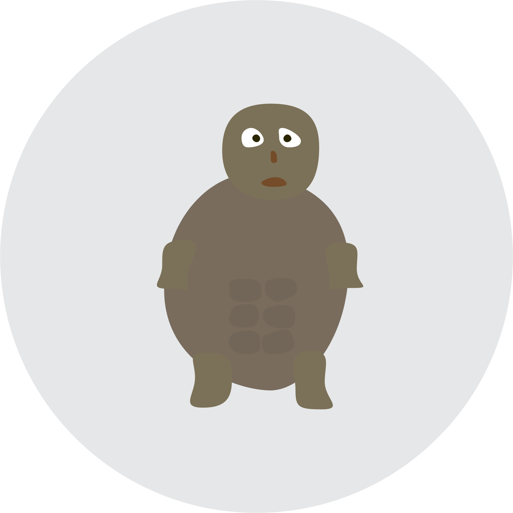

# Graphics Design
`2024 Fall | Professor Izia Lindsay`

- *Adobe Illustrator*: Vector images. Logos.
- *Adobe Photoshop*: Raster images. Photos.
- *Adobe After Effects*: Motion graphics. Animations.
- *Adobe InDesign*: Multi-page layouts. Books, journals, etc.

*Project 1: Create a simple emoji with Illustrator. I made a turtle.*

#### Tips fot Illustrator
- Inches for paper. Pixels for digital files.
- 300 PPI.
- RGB Color. Even if for print, we can convert it later, so recommended to use RGB Color.
- The "Futura" font family makes everything look good.

 
