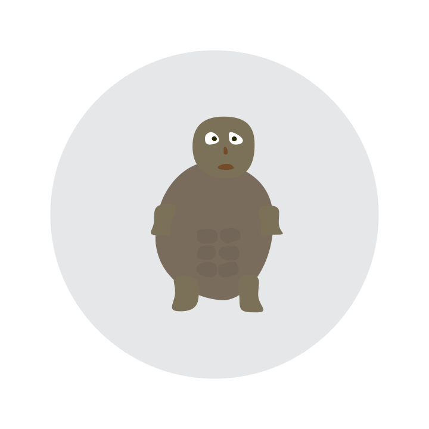
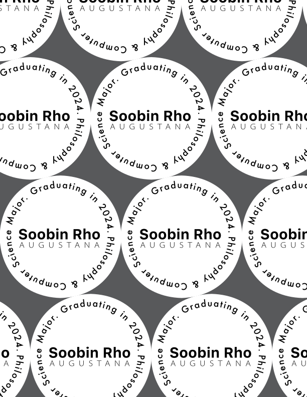
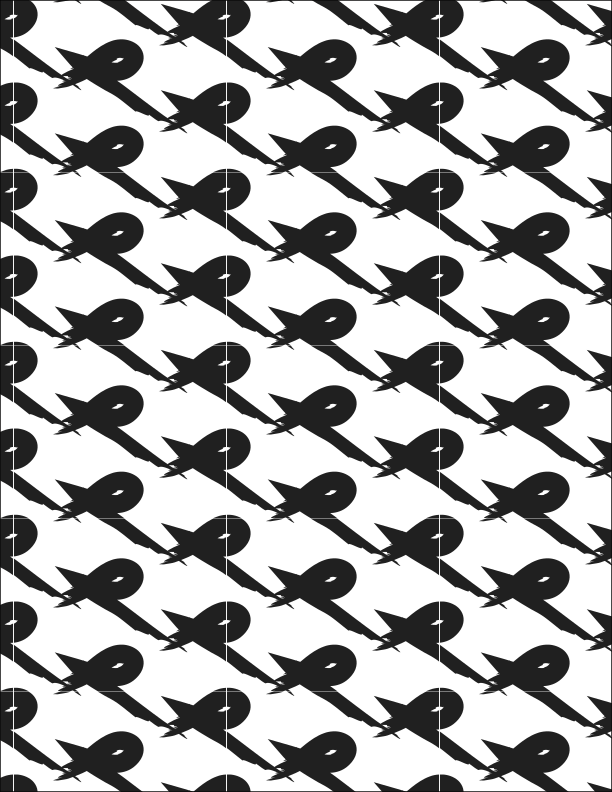
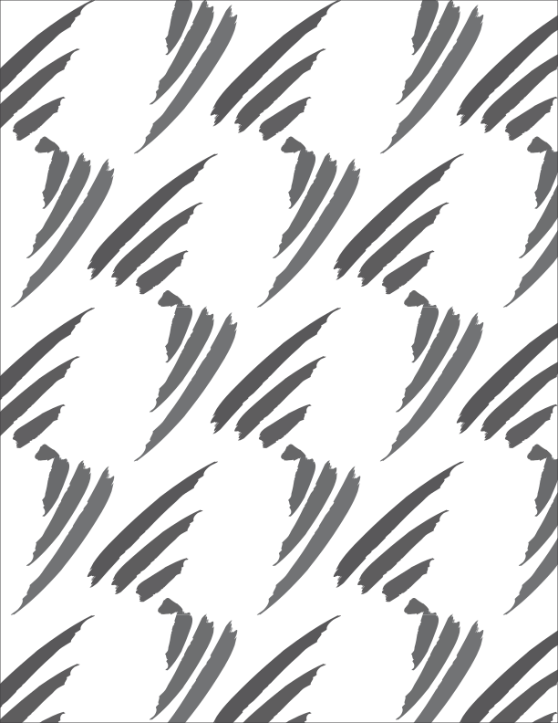
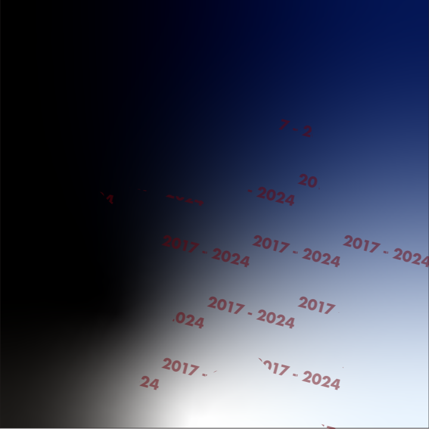
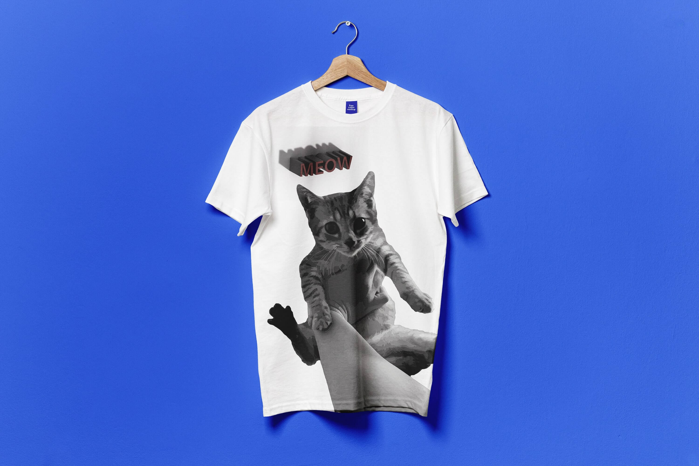

# Graphics Design
`2024 Fall | Professor Izia Lindsay`

- *Adobe Illustrator*: Vector images. Logos.
- *Adobe Photoshop*: Raster images. Photos.
- *Adobe After Effects*: Motion graphics. Animations.
- *Adobe InDesign*: Multi-page layouts. Books, journals, etc.

*Project 1: Create a simple emoji with Illustrator. I made a turtle.*

 

*Project 2: Create patterns. I made random patterns.*

 

*Project 3: T-shirt design. Meow.*

 

#### Tips for Illustrator
##### 2024-08
- Inches for paper. Pixels for digital files.
- 300 PPI.
- RGB Color. Even if for print, we can convert it later, so recommended to use RGB Color.
- The "Futura" font family makes everything look good.

##### 2024-09
- "Object" - "Blend" makes really cool stuff.
- "Object" - "Pattern" too.
- "Window" - "Brushes" has great styles.
- "File" - "Export" - "Use Artboards" is a better option usually because it exports the entire board. Otherwise, it just exports the active area.
- "Object" - "Lock" - "Selection" allows you to prevent some objects from being selected.

- Nice coloring tool -- Select multiple overlapping shapes with the selection tool and press `k`. You can now fill specific areas of the overlapping shapes.
- Cool text shapes -- Select the text and "Object" - "Envelope Distort" - "Make with Warp..."
- Shape text to whatever shape you want - Create desired shape. Select both the shape and the text and "Object" - "Envelope Distort" - "Make with Top Object"
- The pen tool is super useful. Lots of designers mainly use Illustrator for the pen tool.
- To draw curves with the pen tool, click and hold. To reset the curve for the next line, click the anchor point.

- I discovered that Illustrator is actually good at editing pdf files. All the text files and shapes can be modified at Illustrator.

 
