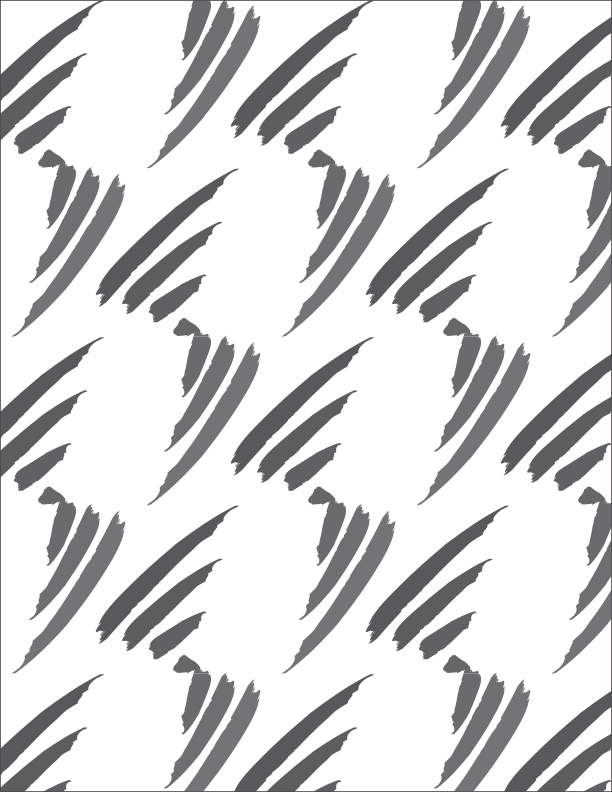

# Graphics Design
`2024 Fall | Professor Izia Lindsay`

- *Adobe Illustrator*: Vector images. Logos.
- *Adobe Photoshop*: Raster images. Photos.
- *Adobe After Effects*: Motion graphics. Animations.
- *Adobe InDesign*: Multi-page layouts. Books, journals, etc.

*Project 1: Create a simple emoji with Illustrator. I made a turtle.*

*Project 2: Create patterns. R here stands for my last name Rho.*

#### Tips for Illustrator
##### 2024-08
- Inches for paper. Pixels for digital files.
- 300 PPI.
- RGB Color. Even if for print, we can convert it later, so recommended to use RGB Color.
- The "Futura" font family makes everything look good.

##### 2024-09
- "Object" - "Blend" makes really cool stuff.
- "Object" - "Pattern" too.
- "Window" - "Brushes" has great styles.
- "File" - "Export" - "Use Artboards" is a better option usually because it exports the entire board. Otherwise, it just exports the active area.

 
