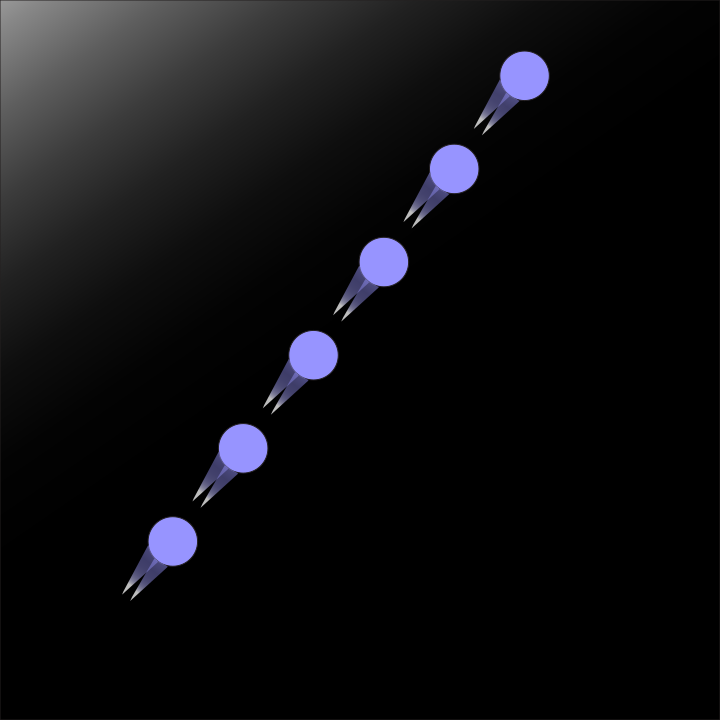

# Graphics Design
`2024 Fall | Professor Izia Lindsay`

- *Adobe Illustrator*: Vector images. Logos.
- *Adobe Photoshop*: Raster images. Photos.
- *Adobe After Effects*: Motion graphics. Animations.
- *Adobe InDesign*: Multi-page layouts. Books, journals, etc.

*Project 1: Create a simple emoji with Illustrator. I made a turtle.*

 

*Project 2: Create patterns. I made random patterns.*

 

*Project 3: T-shirt design. Meow.*

 

## Tips for Illustrator
### General
- Inches for paper. Pixels for digital files.
- 300 PPI.
- RGB Color. Even if for print, we can convert it later, so recommended to use RGB Color.
- The "Futura" font family makes everything look good.
- I discovered that Illustrator is actually good at editing pdf files. All the text files and shapes can be modified at Illustrator.

### Cool Tools
- "Object" - "Blend" makes really cool stuff.
- "Object" - "Pattern" too.
- "Window" - "Brushes" has great styles.
- "File" - "Export" - "Use Artboards" is a better option usually because it exports the entire board. Otherwise, it just exports the active area.
- "Object" - "Lock" - "Selection" allows you to prevent some objects from being selected.
- Nice coloring tool -- Select multiple overlapping shapes with the selection tool and press `k`. You can now fill specific areas of the overlapping shapes.
- Cool text shapes -- Select the text and "Object" - "Envelope Distort" - "Make with Warp..."
- Shape text to whatever shape you want - Create desired shape. Select both the shape and the text and "Object" - "Envelope Distort" - "Make with Top Object"
- The pen tool is super useful. Lots of designers mainly use Illustrator for the pen tool.
- To draw curves with the pen tool, click and hold. To reset the curve for the next line, click the anchor point.

### Cool 3D effects
- "3D and Materials" - "3D (Classic)" - "Extrude & Bevel" - "Ray Tracing" - Render"
- "3D and Materials" - "3D (Classic)" - "Extrude & Bevel (Classic)..."
- "3D and Materials" - "3D (Classic)" - "Revolve (Classic)..."
- "3D and Materials" - "3D (Classic)" - "Rotate (Classic)..."

### Brand Design
- For brand design, choose a logo mark, logo type, and brand color palette.
- Adobe Color Palette generator is a good resource.
- Personally, I'd like to create a color version and a dark-mode version.

 

## Tips for Photoshop
### Photoshop Basics
- Whenever you first make a new design, ensure that the size is correct. Fixing it later on is much harder.
- 300DPI, RGB.
- {Select a part of the image} - "Ctrl + j" to create a new layer with that mask - "Ctrl + t" to create anchor points to resize or rotate.
- It's a good habit to always name the layer. Double click the layer name to rename it.
- "Ctrl + 0" to size fit to screen.
- "Object Selection Tool" - "Mode: Lasso Tool" - "Ctrl + j" - "Ctrl + t" to copy and object.
- "Image" - "Adjustments" - "Hue/Saturation..." to change the color of the selected layer.
- "Magnetic Lasso Tool" and drag around the object - "Ctrl + j" - "Ctrl + t". "Delete" to delete the last point. Allows us to manually mask objects.
- Brush tool is super useful. Press "[" or "]" to change the size of the brush. Right click to change the brush shape. There are really cool brushes, such as fire effects and light effects. Also, double click the layer and add "Inner Glow" and "Outer Glow" to add special effects. https://brusheezy.com has really nice brushes. Whenever we're using the soft brush, the bigger the brush, the better the blend.
- One of the best ways to blend two layers is to click the top layer and do "Layer Blend" - "Brush Tool" - and then soft brush. Again, the bigger the brush, the better the blend. Here, note that the brush's color should be either black or white. Otherwise, the blend won't work.
- https://pixabay.com and https://pexels.com/ have great images (make sure to check licensing).

### Best Way to Refine Edges in a Masked Object
- "Object Selection Tool" - "Select and Mask" - "View: Overlay" - "Opacity: 50%" - "Refine Edge Brush Tool" and then drag over entire edge contour. This masks the edge much better.

### Adjustment Layers and Stuff
- Fastest way to color-correct. "Create new fill or adjustment layer" - "Level" - "Auto". Also, "Create new fill or adjustment layer" - "Vibrance" and increase the vibrance. Make sure it's not too much.
- How to change the color of the entire image. "Create new fill or adjustment layer" - "Photo Filter" and then select the color and density.
- Cool effect to make a black & white background except for your subject. Select an object with the object selection tool and "Select" - "Inverse" - "Black & White"
- How to change the color of a selected object. Use the object selection tool and "Create new fill or adjustment layer" - "Hue/Saturation..." and then change the color to whatever you want.
- How to blend layers. Select the top layer and change "Normal" to whatever blend mode you want.
- How to delete an object flawlessly. Select the object you want to delete with the lasso tool. Press delete.
- Same but a little bit faster than above. "Spot Healing Brush Tool"
- Same but you can where exactly to sample from. "Patch Tool"
- Really nice assortment of filters. "Filter" - "Filter Gallery"
- These adjustment layers apply to all layers beneath by default. If you click the button above the "Layer Channels Paths", it only applies to the topmost layer.

 

*Final Project: I made a magazine about three of my favorite aircrafts on Microsoft Flight Simulator 2024.*

 
